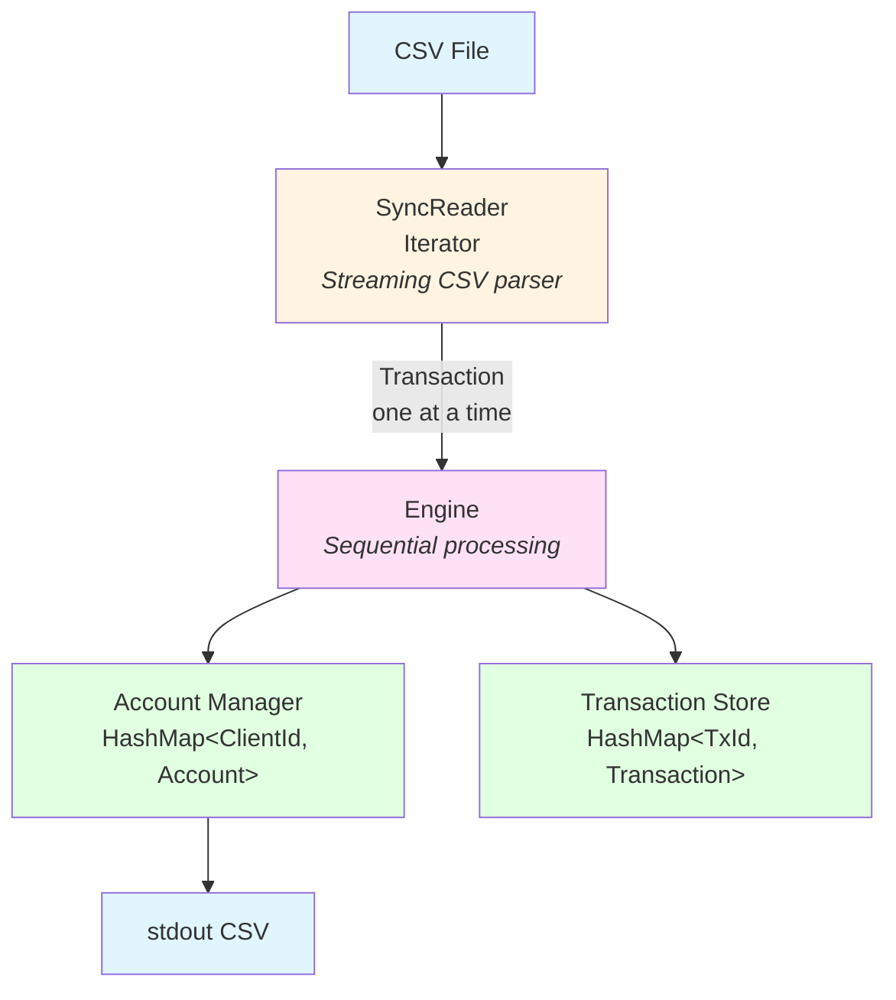
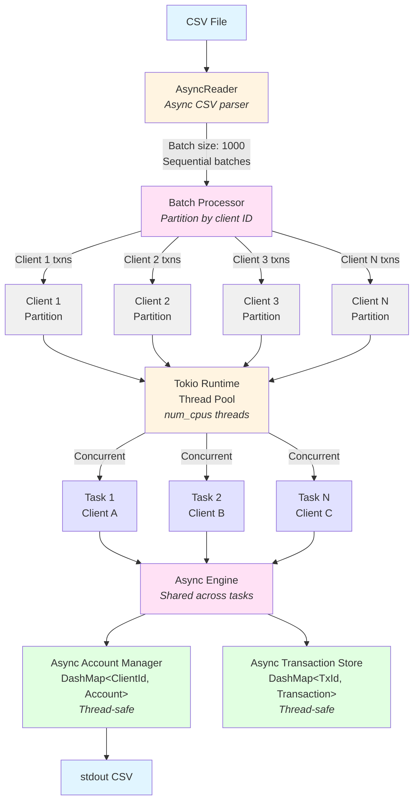

# Rust Payments Engine
## Overview

This project implements an experimental streaming CSV transaction processor that maintains client account states while handling deposits, withdrawals, disputes, resolutions, and chargebacks. The engine supports both synchronous and asynchronous processing strategies, as well as built in benchmarking to evaluate them.

### Sync vs Async Processing

The engine offers two processing strategies:

- **Asynchronous (Default)**: Designed for high-throughput scenarios with multiple concurrent connections, such as processing transactions from network streams or handling multiple files simultaneously. The async strategy shines when you need to maximize CPU utilization across many concurrent operations and shows significantly better performance on large datasets.

- **Synchronous**: Optimized for small file processing with minimal overhead. Since CSV parsing is fundamentally I/O-bound when reading from disk, synchronous processing provides simpler code paths and lower overhead for small workloads.

**Why async is the default**: Based on benchmark results, async processing delivers 258% better performance on large files and 77% better performance on medium files. While sync has lower overhead for very small files (< 100 transactions), async provides superior throughput for typical production workloads.

### Architecture Diagrams

#### Synchronous Strategy



#### Asynchronous Strategy


## Quick Start

### Basic Usage

```bash
# Process transactions with default async strategy
cargo run --release -- transactions.csv > accounts.csv

# Use sync strategy for small files with minimal overhead
cargo run --release -- --strategy sync transactions.csv > accounts.csv

# View help
cargo run -- --help
```

## Transaction Types Supported

The engine handles all standard payment operations:

### Core Operations
- **Deposit**: Credit funds to a client account
- **Withdrawal**: Debit funds from a client account (with insufficient funds protection)

### Dispute Resolution
- **Dispute**: Place a hold on funds from a previous transaction
- **Resolve**: Release held funds back to available balance
- **Chargeback**: Reverse a disputed transaction and lock the account

## Edge Cases Handled

The engine robustly handles numerous edge cases and error conditions:

- **Insufficient Funds**: Withdrawals that would result in negative balances are rejected
- **Invalid References**: Disputes, resolves, and chargebacks on non-existent transactions are ignored
- **State Validation**: Resolves and chargebacks only apply to currently disputed transactions
- **Account Locking**: Transactions on locked accounts (post-chargeback) are rejected
- **Duplicate Transactions**: Duplicate transaction IDs are detected and handled gracefully
- **Precision Handling**: All amounts maintain 4 decimal place precision using fixed-point arithmetic
- **Malformed Data**: Invalid CSV rows are logged and skipped without halting processing

## Safety and Robustness

### Type Safety
- **Fixed-Point Arithmetic**: Uses `rust_decimal::Decimal` for all monetary values, eliminating floating-point precision errors
- **Strong Typing**: Leverages Rust's type system with enums for transaction types and dedicated types for accounts
- **Checked Operations**: All balance calculations use checked arithmetic to prevent overflow/underflow
- **Memory Safety**: Zero unsafe code - all memory safety guaranteed by Rust's ownership system
- **Thread Safety**: Concurrent operations in async mode protected by type-safe concurrent data structures
- **No Null Pointers**: Option types eliminate null pointer dereferences and segmentation faults

### Error Handling
- **Graceful Degradation**: Individual transaction errors don't halt processing; errors are logged to stderr
- **Result Types**: All fallible operations return `Result<T, E>` with descriptive error types
- **No Panics**: Production code avoids `unwrap()` and `expect()` in favor of proper error propagation

### Test Coverage
- **Coverage**: 92.32% (613/664 lines covered)
- **Unit Tests**: Comprehensive tests for individual components and business logic (216 tests)
- **Integration Tests**: End-to-end tests with 12 fixture scenarios covering happy paths and edge cases (24 tests)

## Performance

### Benchmark Results

Performance benchmarks across different file sizes (100 samples each):

| Strategy | File Size | Median Time | Throughput | vs Sync |
|----------|-----------|-------------|------------|---------|
| Async | Large (1M txns) | 790.5 ms | ~1.26M txns/sec | **+258% faster** |
| Sync | Large (1M txns) | 2.828 s | ~354,000 txns/sec | baseline |
| Async | Medium (10K txns) | 1.42 ms | ~7.04M txns/sec | **+77% faster** |
| Sync | Medium (10K txns) | 2.518 ms | ~3.97M txns/sec | baseline |
| Async | Small (100 txns) | 477.3 µs | ~209,000 txns/sec | -43% slower |
| Sync | Small (100 txns) | 273.7 µs | ~365,000 txns/sec | baseline |

### Performance Analysis

**Key Findings**:
- Async strategy significantly outperforms sync on large and medium files
- Async delivers 258% better performance on large files (1M transactions)
- Async delivers 77% better performance on medium files (10K transactions)
- Sync has lower overhead for very small files (< 100 transactions) but the difference is negligible

## Maintainability

### Architecture

The codebase follows a clean, modular architecture:

```
src/
├── types/           # Core data types (Account, Transaction, Error)
├── core/            # Business logic (Engine, AccountManager, TransactionStore)
│   └── async/       # Async implementations
├── io/              # CSV parsing and output formatting
├── strategy/        # Processing strategy implementations
└── cli/             # Command-line interface
```

### Dependencies

Core libraries selected for production reliability:
- `csv` (1.4): Industry-standard CSV parsing with streaming support
- `serde` (1.0): Zero-cost serialization framework with derive macros
- `rust_decimal` (1.40): Fixed-point decimal arithmetic for financial calculations
- `clap` (4.5): Modern CLI argument parsing with derive macros
- `thiserror` (2.0): Ergonomic error type derivation

Async processing dependencies:
- `tokio` (1.49): Async runtime with multi-threaded executor
- `tokio-util` (0.7): Compatibility layer between tokio and csv-async
- `csv-async` (1.3): Async CSV parsing
- `futures` (0.3): Async stream utilities
- `dashmap` (7.0): Concurrent HashMap for async operations
- `num_cpus` (1.17): CPU core detection for optimal parallelism

Development tools:
- `rstest` (0.26): Parameterized testing for table-driven tests
- `divan` (0.1): Statistical benchmarking framework
- `tempfile` (3.24): Temporary file handling for tests

### Code Quality

- **Documentation**: Comprehensive doc comments on components and APIs
- **Formatting**: Enforced via `cargo fmt`
- **Linting**: Zero clippy warnings
- **Testing**: High coverage across unit, integration, and e2e tests
- **Traits**: Clean abstractions for account management and transaction storage

## Development

### Running Tests

```bash
# Run all tests
cargo test

# Run with output
cargo test -- --nocapture

# Run specific test suite
cargo test --test e2e_tests

# Run benchmarks
cargo bench
```

### Code Quality Checks

```bash
# Format code
cargo fmt

# Run linter
cargo clippy -- -W clippy::all

# Check without building
cargo check
```

### Documentation

```bash
# Generate and open documentation in browser
cargo doc --open

# Generate documentation without opening
cargo doc

# Generate documentation with private items
cargo doc --document-private-items

# Generate documentation for dependencies too
cargo doc --open --no-deps
```

The documentation includes:
- API documentation for all public types and functions
- Module-level documentation explaining architecture
- Links between related types and functions

## AI-Assisted Development

This project was developed using AI-assisted tooling (Kiro) to accelerate boilerplate generation, documentation, and test creation. All generated code has been thoroughly reviewed, curated, and refined by a human.

**Human Decisions**:
- Core type design (Account, Transaction, Error types)
- Selection of dependencies (rust_decimal for financial precision, tokio for async runtime, etc.)
- Module organization and separation of concerns
- Strategy pattern and sync/async implementations
- Error handling approach and recovery strategies
- Test coverage strategy and fixture design
